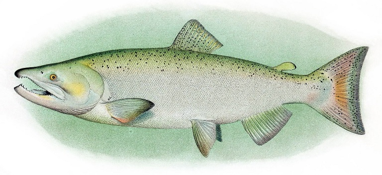

# Analysis of Chinook salmon gut contents

This repository contains the scripts that were used in the manuscript *"Phenological diversity of a prey species supports life-stage specific foraging opportunity for a mobile consumer"*.

## Study Overview

Forage fish provide a critical link between upper and lower trophic levels in coastal food webs, and their highly variable abundance and seasonal spawn timing provide extended foraging opportunities for coastal predators. In this study, we quantified how phenological diversity in Pacific herring supports Chinook salmon consumption, and thus growth, throughout the year. We used genetic stock identification to assign individual herring collected from the guts of juvenile and adult Chinook salmon to herring populations with distinct spawning phenologies and evaluated changes in the relative proportion of herring spawning groups as a function of salmon life stage (juvenile vs. adult) and season of capture (spring, summer, winter). 

## Directory structure

- Genotype data are in the folders:
    - *data_genepop.files*
    - *data_rubias.files*
- Sample metadata are in the folder:
  - *data_sample.metadata* 
- Analytical scripts are stored in folders with the prefix *analysis_*.
    - Each analysis and its outputs are organized in distinct folders 
    
---
Drawing of Chinook salmon by A. Hoen and Co. - Scanned from plates in Evermann, Barton Warren; Goldsborough, Edmund Lee (1907) The Fishes of Alaska, Washington, D.C.: Department of Commerce and Labor Bureau of Fisheries

